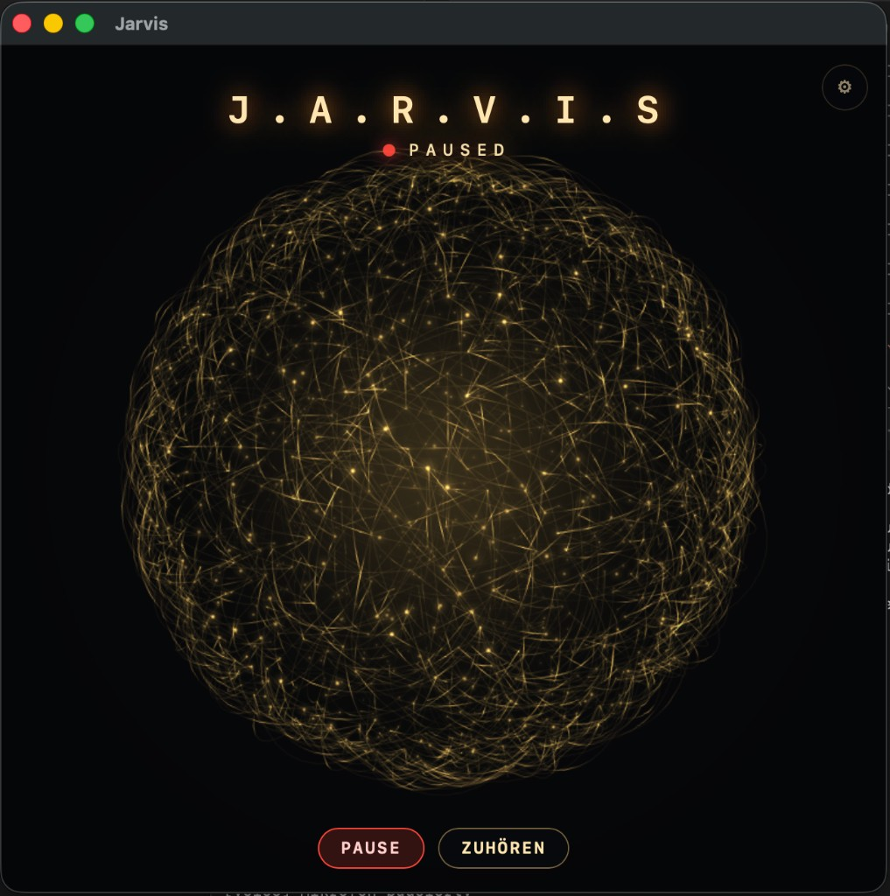

# Jarvis

**Sprachgesteuerter Assistent für macOS mit direkter Anbindung an eine lokale Hermes-Installation.**

<p align="center">
  
</p>

Jarvis ist mein persönlicher Sprachassistent für macOS. Das Projekt basiert auf einem Fork von [Sujatx/Jarvis](https://github.com/Sujatx/Jarvis), den ich für meinen eigenen Workflow weiterentwickelt habe.

Mein Fork erweitert das ursprüngliche Projekt unter anderem um deutsche Sprachsteuerung, die direkte Anbindung an Hermes, die Anzeige des OpenAI-Codex-Kontingents, lokale macOS-Funktionen und zusätzliche Sicherheitsgrenzen für sprachgesteuerte Aktionen.

Anstatt eine Frage einzutippen und mit Enter abzuschicken, spreche ich einfach mit Jarvis. Nach einer kurzen Sprechpause wird die Anfrage automatisch verarbeitet und die Antwort anschließend vorgelesen.

> 🇬🇧 **English documentation:** [README.md](README.md)

---

## Funktionen

- Natürliche Sprachsteuerung ohne Enter
- Direkte Verbindung mit einer bestehenden lokalen Hermes-Installation
- Deutsche Spracherkennung und Sprachausgabe
- Antworten können jederzeit unterbrochen werden
- Optionaler Rufname **Jarvis**
- Anzeige des verfügbaren OpenAI-Codex-Kontingents
- Lokale Befehle ohne Hermes-Anfrage
- Dateisuche in definierten macOS-Verzeichnissen
- Bestätigung vor dem Öffnen von Dateien, Webseiten oder Anwendungen
- Einstellbare Stimme, Mikrofonquelle, Lautstärke und Animation
- Integration in die macOS-Menüleiste
- Lokale Ersatzstimme bei nicht verfügbarer Netzwerk-Sprachausgabe
- Persönliche Informationen werden nur auf ausdrücklichen Wunsch gespeichert
- Keine API-Schlüssel oder Zugangsdaten im Repository

---

## Bedienung

Jarvis ist darauf ausgelegt, möglichst natürlich per Sprache bedient zu werden.

Einfach auf Deutsch sprechen. Nach einer kurzen Pause erkennt Jarvis automatisch das Ende der Eingabe und schickt die Anfrage ab.

Ein Druck auf Enter ist nicht notwendig.

Während Jarvis seine Antwort vorliest, kann die Sprachausgabe jederzeit unterbrochen und direkt weitergesprochen werden.

Über **Pause** lässt sich das Mikrofon schließen und eine laufende Sprachausgabe abbrechen. Mit **Zuhören** wird die Spracherkennung wieder aktiviert.

Für lautere Umgebungen kann in den Einstellungen festgelegt werden, dass Jarvis nur auf Spracheingaben reagiert, wenn zuvor sein Name genannt wurde.

Die Oberfläche ist bewusst reduziert gehalten. Im Mittelpunkt steht die animierte Jarvis-Kugel. Weitere Einstellungen sind über das Zahnrad erreichbar.

Das rote Schließen des Hauptfensters beendet Jarvis nicht vollständig, sondern blendet das Fenster aus. Beendet wird die Anwendung über das Symbol in der macOS-Menüleiste.

---

## Hermes-Anbindung

Jarvis verwendet keine eigene KI-Anmeldung.

Stattdessen verbindet sich die Anwendung mit einer bereits auf dem Mac installierten und angemeldeten **Hermes-Umgebung**.

Dadurch ist weder ein zusätzliches Benutzerkonto für Jarvis erforderlich noch müssen API-Schlüssel direkt im Projekt hinterlegt werden.

Profil, Modell und Provider werden lokal konfiguriert.

Im Einstellungsbereich zeigt Jarvis an:

- ob Hermes gefunden wurde
- welches Hermes-Profil aktiv ist
- welches Modell verwendet wird
- welcher Provider verwendet wird
- wie viel vom OpenAI-Codex-Kontingent noch verfügbar ist

Die Nutzungsdaten können direkt aus Jarvis aktualisiert werden.

Jarvis zeigt vorhandene Limits lediglich an. Er kann keine Kontingente oder Limits verändern oder erhöhen.

---

## Lokale Funktionen

Nicht jede Anweisung muss über Hermes oder ein Sprachmodell verarbeitet werden.

Einige Funktionen führt Jarvis direkt auf dem Mac aus.

Dazu gehören beispielsweise:

- Uhrzeit
- Timer
- Lautstärkesteuerung
- Wiederholen der letzten Antwort

Jarvis kann außerdem Dateien in definierten Verzeichnissen suchen:

- Schreibtisch
- Dokumente
- Downloads
- Jarvis-Projektordner

Das tatsächliche Öffnen einer Datei, einer Webseite oder von Safari erfolgt erst nach einer Bestätigung im Jarvis-Fenster.

Wird die Aktion abgelehnt oder läuft die Bestätigung ab, wird nichts geöffnet.

Kann eine angeforderte Aktion nicht ausgeführt werden, meldet Jarvis dies, anstatt einen erfolgreichen Ablauf vorzutäuschen.

---

## Voraussetzungen

Für den aktuellen Stand werden benötigt:

- macOS 13 oder neuer
- Python 3
- Xcode Command Line Tools
- eine installierte und angemeldete Hermes-Umgebung

---

## Installation

Repository klonen und in das Projektverzeichnis wechseln:

```bash
git clone https://github.com/s3vdev/Jarvis.git
cd Jarvis
```

Anschließend einmalig ausführen:

```bash
./setup.command
```

Das Setup legt unter anderem ein eigenes Python Virtual Environment an:

```text
.venv
```

Nach der Einrichtung kann Jarvis per Doppelklick gestartet werden:

```text
Jarvis starten.command
```

Der Starter sucht Hermes automatisch an mehreren Stellen:

1. im normalen System-`PATH`
2. über `JARVIS_HERMES`
3. unter `~/.hermes/installs`

Ist Port `8777` bereits belegt, bricht der Starter ab, anstatt eine zweite kollidierende Instanz zu starten.

---

## Konfiguration

Die Standardkonfiguration befindet sich in:

```text
jarvis.json
```

Rechnerspezifische Einstellungen können separat gespeichert werden:

```text
jarvis.local.json
```

Alternativ können Umgebungsvariablen verwendet werden:

```text
JARVIS_HERMES
JARVIS_HERMES_PROFILE
JARVIS_HERMES_MODEL
JARVIS_HERMES_PROVIDER
```

Zugangsdaten, Passwörter oder API-Schlüssel gehören nicht in das Repository.

---

## Stimme und Mikrofon

Stimme, Mikrofon, Lautstärke, optionaler Rufname und Animation können über die Einstellungen angepasst werden.

Aktuell stehen unter anderem folgende konfigurierte Stimmen zur Verfügung:

- Conrad
- Killian
- Florian

Die jeweilige Stimme kann direkt in den Einstellungen probegehört werden.

Ist die normale Netzwerk-Sprachausgabe nicht verfügbar, kann Jarvis auf die lokale macOS-Stimme **Anna** zurückgreifen.

Beim ersten Start kann macOS nach der Mikrofonberechtigung für das Terminal beziehungsweise den Prozess fragen, über den Jarvis gestartet wurde.

---

## Sicherheit und Hermes-Freigaben

Ein Sprachassistent braucht andere Sicherheitsgrenzen als eine klassische Texteingabe.

Deshalb können über Jarvis bewusst **keine neuen Hermes-Berechtigungen allein per Sprache bestätigt werden**.

Jeder Start von Jarvis beginnt mit einer neuen Sitzung. Bereits bestehende Hermes-Freigaben bleiben dabei erhalten.

Benötigt ein Befehl eine zusätzliche Freigabe, wird diese Aktion nicht automatisch über die Sprachsteuerung ausgeführt.

Insbesondere werden folgende uneingeschränkte Hermes-Modi von Jarvis nicht verwendet:

```text
hermes -z
--yolo
```

Damit soll verhindert werden, dass eine falsch erkannte oder unbeabsichtigt aufgenommene Sprachanweisung zusätzliche Zugriffsrechte erhält.

Benötigt eine Aktion tatsächlich eine neue Hermes-Freigabe, kann die bestehende Sitzung manuell im Terminal fortgesetzt werden.

Dazu Jarvis zunächst beenden, beispielsweise mit:

```text
Strg+C
```

Die aktuelle Hermes-Sitzungs-ID wird gespeichert unter:

```text
.run/hermes-session.json
```

Die Sitzung kann anschließend beispielsweise so fortgesetzt werden:

```bash
cd /Pfad/zu/Jarvis

hermes -p default chat \
  --cli \
  --ignore-rules \
  -t terminal \
  -m gpt-6-astra \
  --provider openai-codex \
  --in "$PWD" \
  --resume HIER_DIE_EXAKTE_SITZUNGS_ID
```

Profil, Modell und Provider müssen dabei gegebenenfalls an die eigene Hermes-Konfiguration angepasst werden.

---

## Persönliche Informationen

Jarvis speichert nicht automatisch alles dauerhaft, was gesprochen wird.

Informationen, die über mehrere Sitzungen hinweg verfügbar sein sollen, werden getrennt unter **Persönliches** gespeichert.

Sie können entweder direkt über den Einstellungsbereich verwaltet oder per Sprache hinzugefügt werden, beispielsweise mit:

```text
merk dir …
```

Jarvis liest nur die dort gespeicherten Informationen.

Neue persönliche Informationen werden nur geschrieben, wenn sie ausdrücklich gespeichert oder über „merk dir“ hinzugefügt werden.

Passwörter, API-Schlüssel und andere sensible Zugangsdaten sollten dort nicht gespeichert werden.

---

## Sitzungen

Jeder Start von Jarvis beginnt bewusst mit einer frischen Sitzung.

Dadurch ist eine neue Sprachunterhaltung zunächst unabhängig von vorherigen Unterhaltungen.

Dauerhafte Informationen werden nicht über die Gesprächshistorie, sondern über den gesonderten Bereich **Persönliches** bereitgestellt.

Hermes-Freigaben und persistente persönliche Informationen sind damit bewusst von der eigentlichen Sprachsitzung getrennt.

---

## Tests

Die Kernlogik lässt sich testen, ohne das Mikrofon zu verwenden und ohne eine Anfrage an ein Sprachmodell zu senden:

```bash
.venv/bin/python -m unittest discover -s tests -v
```

Dabei bleibt auch der Visualizer deaktiviert.

Für einen echten Integrationstest mit Hermes steht außerdem zur Verfügung:

```bash
.venv/bin/python tests/smoke_hermes.py
```

Dieser Test führt zwei echte Modellanfragen aus und verbraucht deshalb Kontingent des konfigurierten Accounts.

---

## Herkunft des Projekts

Dieses Repository ist ein Fork von:

[Sujatx/Jarvis](https://github.com/Sujatx/Jarvis)

Das ursprüngliche Gesicht sowie die frühere Jarvis-Voice-Line stammen aus diesem Projekt.

Mein Fork erweitert den ursprünglichen Stand unter anderem um:

- direkte lokale Hermes-Anbindung
- deutsche Sprachsteuerung
- Anzeige des OpenAI-Codex-Kontingents
- zusätzliche lokale macOS-Funktionen
- eigene Konfigurationsmöglichkeiten
- Sicherheitsgrenzen für Sprachbefehle
- Tests und automatisierte Einrichtung

Weitere Informationen zur Herkunft einzelner Bestandteile stehen in:

[NOTICE](NOTICE)

Das Upstream-Repository weist derzeit keine Open-Source-Lizenz aus. Vor Weitergabe oder Wiederverwendung von Bestandteilen aus dem ursprünglichen Projekt sollten deshalb die Hinweise in `NOTICE` beachtet werden.

---

## Technische Schwerpunkte

- macOS
- Python
- Hermes
- OpenAI Codex
- Spracherkennung
- Text-to-Speech
- lokale macOS-Automatisierung

---

## Autor

Fork und Weiterentwicklung durch **Sven Mielke / s3vdev**.

GitHub: [github.com/s3vdev](https://github.com/s3vdev)
