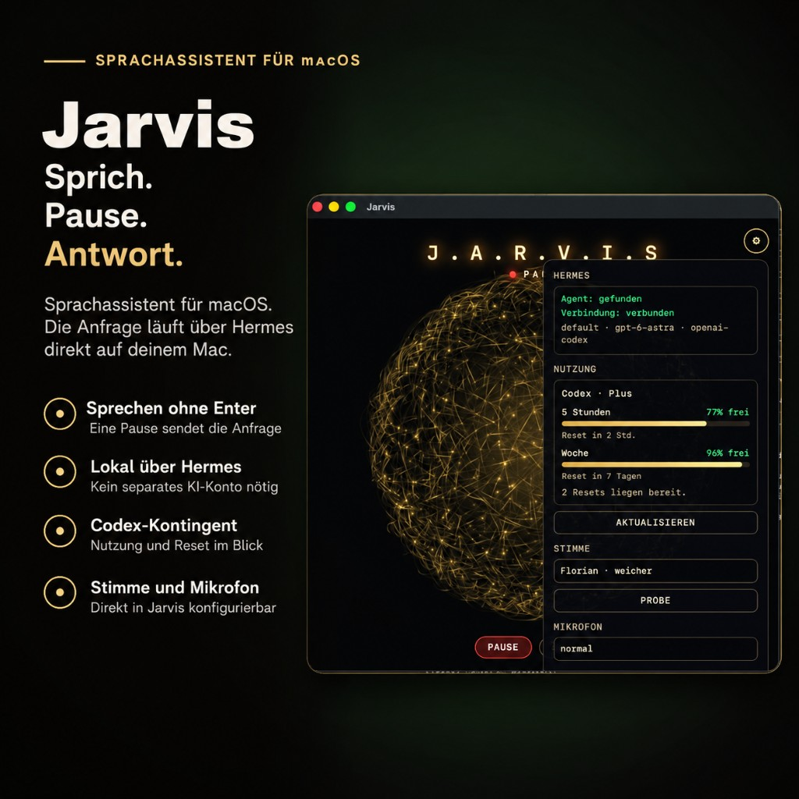

# Jarvis

**A voice-controlled assistant for macOS, connected to a local Hermes installation.**

<p align="center">
  
</p>

Jarvis is my personal macOS voice assistant, based on a fork of the original [Sujatx/Jarvis](https://github.com/Sujatx/Jarvis) project.

I extended the project for my own workflow with German voice interaction, local Hermes integration, OpenAI Codex usage information, configurable voice controls, local macOS actions and additional safeguards for voice-triggered commands.

Instead of typing a prompt and pressing Enter, you simply speak. After a short pause, Jarvis automatically submits the request to Hermes and reads the response back to you.

> 🇩🇪 **Deutsche Dokumentation:** [README-DE.md](README-DE.md)

---

## Features

- Natural voice interaction without pressing Enter
- Direct integration with an existing local Hermes installation
- German speech recognition and text-to-speech
- Interruptible spoken responses
- Optional wake name: **Jarvis**
- OpenAI Codex usage information
- Local commands that do not require Hermes
- File search in predefined macOS folders
- Confirmation before opening files, websites or applications
- Configurable microphone, voice, volume and animation
- Menu bar integration
- Local fallback voice when network-based speech is unavailable
- Persistent personal information only when explicitly saved
- No API keys or account credentials stored in the repository

---

## How it works

Jarvis continuously listens while voice input is enabled.

You speak naturally and, after a short pause, the current utterance is automatically submitted. There is no need to press Enter or manually click a send button.

While Jarvis is speaking, you can interrupt the response and continue talking immediately.

For noisy environments, an optional setting can require the name **Jarvis** before a spoken command is accepted.

The main interface is intentionally minimal and centered around the animated Jarvis orb. Additional controls and configuration are available through the settings panel and the macOS menu bar.

Closing the main window does not terminate Jarvis. The voice session keeps running in the background, including after the launch Terminal is closed. Quit from the menu bar icon. If the voice session dies, the icon leaves with it.

---

## Hermes integration

Jarvis does not provide or maintain its own AI account.

Instead, it connects to an existing **Hermes** installation running on the same Mac.

The active Hermes profile, model and provider are configured locally. No separate API credentials need to be stored inside this repository.

The settings panel shows whether Hermes was detected and which configuration is currently active.

Jarvis can also display the available usage information for the configured OpenAI Codex account. These values can be refreshed from the interface.

Jarvis only displays the available limits. It cannot modify or increase them.

---

## Local commands

Some commands are handled directly on the Mac and do not require a model request.

Examples include:

- Current time
- Timers
- Volume control
- Repeating the previous response

Jarvis can also search for files in predefined locations:

- Desktop
- Documents
- Downloads
- Jarvis project directory

Opening Safari, a website or a file requires confirmation in the Jarvis interface.

If the action is declined or the confirmation times out, nothing is opened.

---

## Requirements

Jarvis currently requires:

- macOS 13 or newer
- Python 3
- Xcode Command Line Tools
- An installed and authenticated Hermes environment

---

## Installation

Clone the repository and change into the project directory:

```bash
git clone https://github.com/s3vdev/Jarvis.git
cd Jarvis
```

Run the setup script once:

```bash
./setup.command
```

The setup creates a dedicated Python virtual environment in:

```text
.venv
```

After setup, a real macOS app is available at:

```text
dist/Jarvis.app
```

Move it to **Applications** like any other app. Personal data and runtime files live in `~/Library/Application Support/Jarvis`, not inside the app bundle.

Double-clicking `Jarvis starten.command` opens the same app once it has been built.

The launcher searches for Hermes in:

1. the normal system `PATH`
2. `JARVIS_HERMES`
3. `~/.hermes/installs`

If Jarvis is already running, the launcher reopens the window. If port `8777` is taken by another process, it stops.

---

## Configuration

The default Hermes configuration is stored in:

```text
jarvis.json
```

Machine-specific settings can be placed in:

```text
jarvis.local.json
```

The following environment variables are also supported:

```text
JARVIS_HERMES
JARVIS_HERMES_PROFILE
JARVIS_HERMES_MODEL
JARVIS_HERMES_PROVIDER
```

Do not store passwords, API keys or other credentials in the repository.

---

## Voice and audio

Voice, microphone, volume and animation can be configured in the settings panel.

The available configured voices currently include:

- Conrad
- Killian
- Florian

A preview can be played directly from the settings.

If network-based speech output is unavailable, Jarvis can fall back to the local macOS voice **Anna**.

On first use, macOS asks for microphone permission for **Jarvis**.

---

## Security model

Voice control requires stricter boundaries than a normal text-based chat interface.

For that reason, Jarvis deliberately does **not** allow spoken input to approve new Hermes permissions.

Every Jarvis launch starts a fresh session, while already granted Hermes permissions remain available.

Commands that require additional approval are not executed through the voice interface.

The following unrestricted Hermes modes are intentionally not used by Jarvis:

```text
hermes -z
--yolo
```

This prevents an incorrectly recognized or accidentally captured voice command from automatically granting broader access.

If an operation requires explicit Hermes approval, stop Jarvis and continue the existing Hermes session manually from the terminal.

The current session ID is stored in:

```text
.run/hermes-session.json
```

Example:

```bash
cd /path/to/Jarvis

hermes -p default chat \
  --cli \
  --ignore-rules \
  -t terminal \
  -m gpt-6-astra \
  --provider openai-codex \
  --in "$PWD" \
  --resume YOUR_EXACT_SESSION_ID
```

Adjust profile, model and provider to match your own Hermes configuration.

---

## Personal information

Jarvis does not automatically turn every conversation into persistent memory.

Personal information is stored separately and only when explicitly requested.

You can manage these entries in the **Personal** section of the settings or add information by saying the equivalent of:

```text
merk dir …
```

Jarvis reads only the information stored there and writes new information only after an explicit save action or command.

Passwords and other sensitive credentials should never be stored there.

---

## Tests

The main logic can be tested without using the microphone or making model requests:

```bash
.venv/bin/python -m unittest discover -s tests -v
```

Hermes integration can be tested with two real requests:

```bash
.venv/bin/python tests/smoke_hermes.py
```

The smoke test uses actual model requests and therefore consumes account quota.

---

## Project origin

This repository is a fork of:

[Sujatx/Jarvis](https://github.com/Sujatx/Jarvis)

The original visual face and the earlier Jarvis voice line originate from that project.

This fork extends the original project with, among other things:

- Local Hermes integration
- German voice interaction
- OpenAI Codex usage information
- Additional macOS controls
- Local command handling
- Voice-specific security restrictions
- Configuration and testing improvements

For details about the origin of individual components, see [NOTICE](NOTICE).

The upstream repository currently does not declare an open-source license. Please review the information in `NOTICE` before redistributing or reusing upstream-derived material.

---

## Technical stack

- macOS
- Python
- Hermes
- OpenAI Codex
- Speech recognition
- Text-to-speech
- Local macOS automation

---

## Author

Fork and further development by **Sven Mielke / s3vdev**.

GitHub: [github.com/s3vdev](https://github.com/s3vdev)
