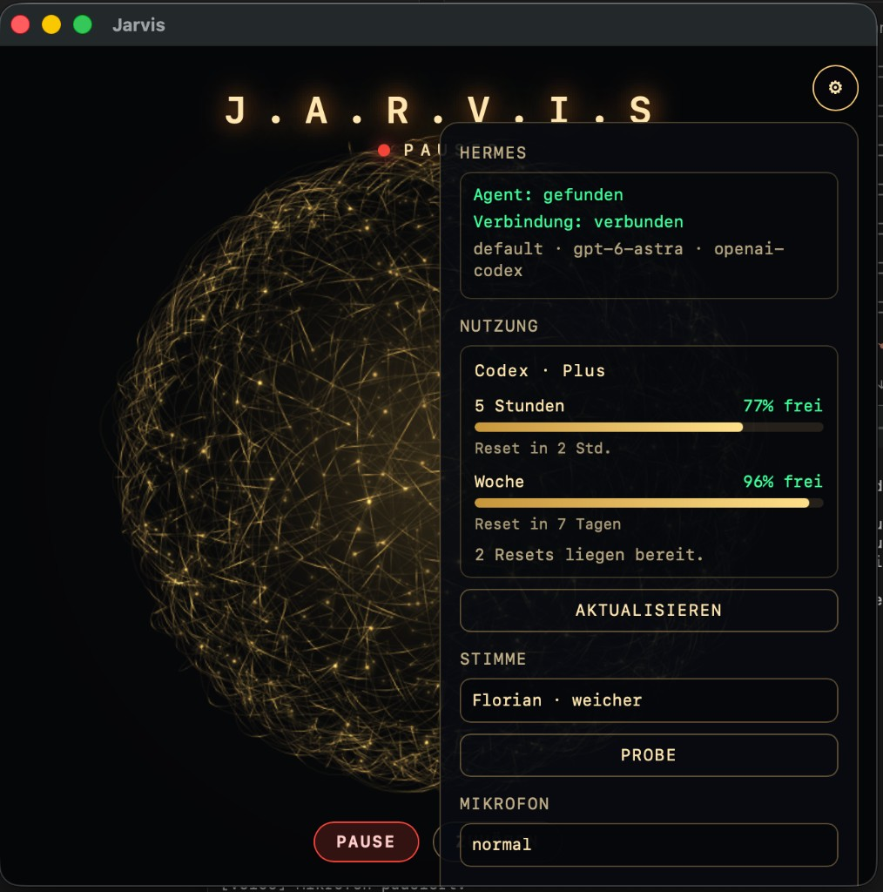

# Jarvis

Lokaler Sprachassistent für **macOS**. Dieses Repo ist der Fork [s3vdev/Jarvis](https://github.com/s3vdev/Jarvis). Er spricht mit dem **Hermes**, das auf dem jeweiligen Rechner schon installiert und angemeldet ist. Kein Claude-Konto, keine Tokens im Repo.

Ursprung: [Sujatx/Jarvis](https://github.com/Sujatx/Jarvis). Bitte [NOTICE](NOTICE) lesen.

  

Das kleine Mac-Fenster zeigt **J.A.R.V.I.S**, die goldene Kugel und unten **PAUSE** / **ZUHÖREN**. Eine Sprechpause schickt die Frage. Du kannst ihm ins Wort fallen.

  

Im Zahnrad: Hermes-Status, Codex-Nutzung, Stimme, Mikrofon, optionaler Rufname, Lautstärke und Animation.

## Start

**Einmal:** `setup.command`  
**Danach:** `Jarvis starten.command` doppelklicken, dann einfach Deutsch sprechen.

Ausführliche Anleitung, Grenzen und Tests: [README-DE.md](README-DE.md).
